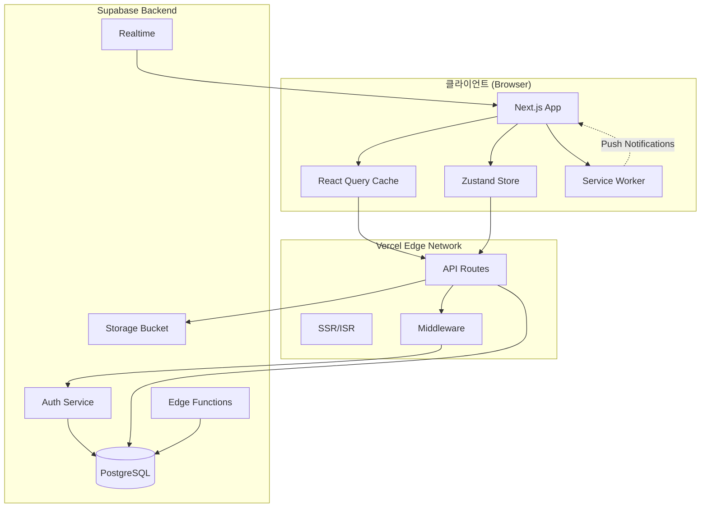
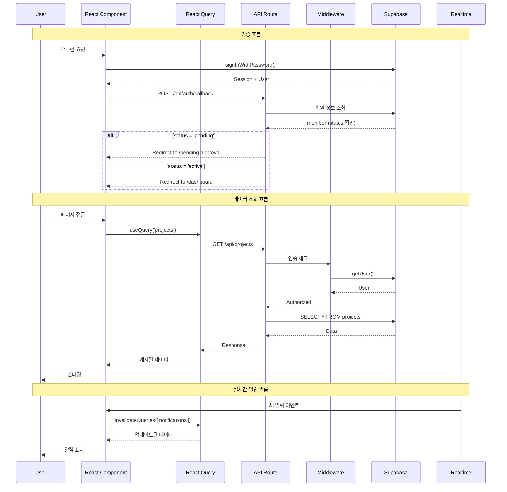
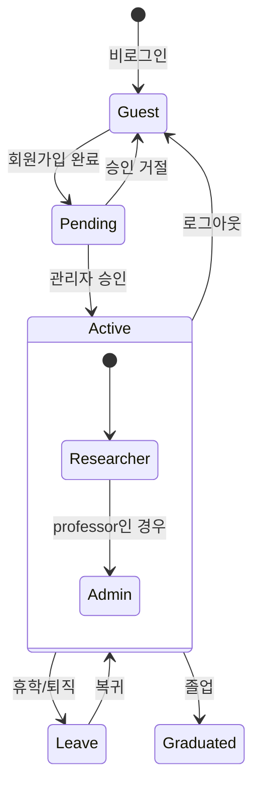
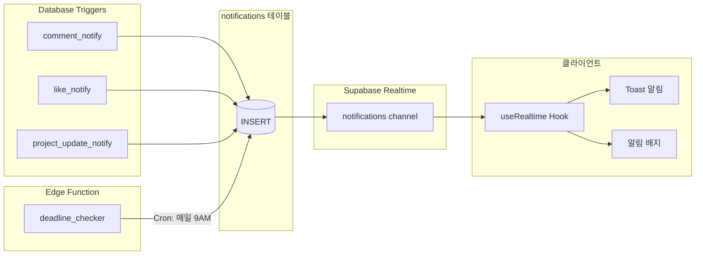
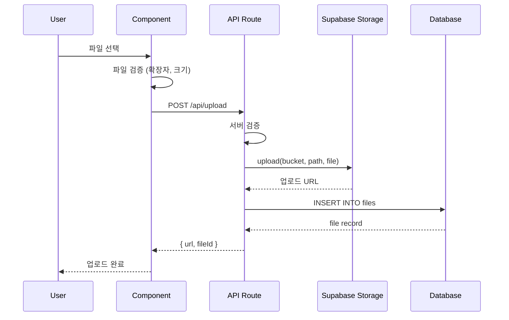
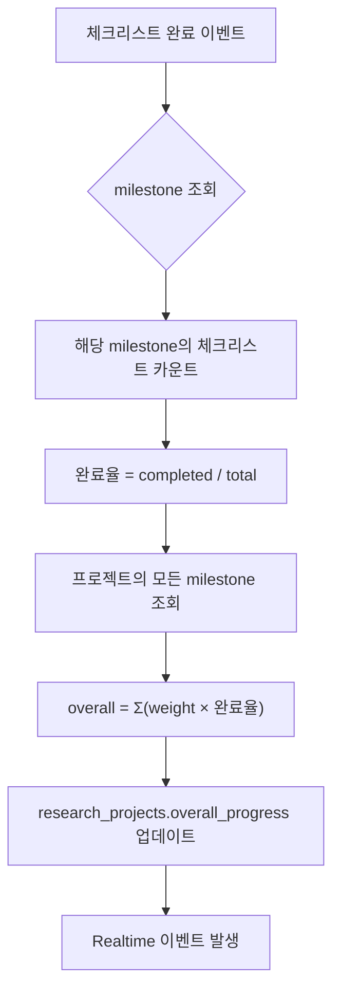

# SDC Lab Dashboard - 시스템 아키텍처

## 1. 전체 시스템 구조



---

## 2. 레이어 아키텍처

### 2.1 프론트엔드 레이어

```
┌─────────────────────────────────────────────────────────────┐
│                      Presentation Layer                      │
│  ┌─────────────┐  ┌─────────────┐  ┌─────────────────────┐  │
│  │   Pages     │  │  Layouts    │  │  UI Components      │  │
│  │  (app/)     │  │             │  │  (shadcn/ui)        │  │
│  └─────────────┘  └─────────────┘  └─────────────────────┘  │
├─────────────────────────────────────────────────────────────┤
│                      Feature Layer                           │
│  ┌─────────────┐  ┌─────────────┐  ┌─────────────────────┐  │
│  │  Features   │  │   Hooks     │  │  Context Providers  │  │
│  │  Components │  │  (Custom)   │  │                     │  │
│  └─────────────┘  └─────────────┘  └─────────────────────┘  │
├─────────────────────────────────────────────────────────────┤
│                      State Layer                             │
│  ┌─────────────────────────┐  ┌─────────────────────────┐   │
│  │      React Query        │  │       Zustand           │   │
│  │   (Server State)        │  │   (Client State)        │   │
│  └─────────────────────────┘  └─────────────────────────┘   │
├─────────────────────────────────────────────────────────────┤
│                      Data Layer                              │
│  ┌─────────────────────────────────────────────────────┐    │
│  │              Supabase Client (lib/supabase.ts)      │    │
│  └─────────────────────────────────────────────────────┘    │
└─────────────────────────────────────────────────────────────┘
```

### 2.2 디렉토리 구조

```
src/
├── app/                          # Next.js App Router
│   ├── (auth)/                   # 인증 관련 라우트 그룹
│   │   ├── login/
│   │   ├── signup/
│   │   └── pending-approval/
│   ├── (dashboard)/              # 대시보드 라우트 그룹
│   │   ├── layout.tsx            # 사이드바 포함 레이아웃
│   │   ├── page.tsx              # Dashboard
│   │   ├── members/
│   │   │   ├── page.tsx          # 목록
│   │   │   └── [id]/page.tsx     # 상세
│   │   ├── research/
│   │   │   ├── page.tsx
│   │   │   ├── new/page.tsx
│   │   │   └── [id]/page.tsx
│   │   ├── calendar/
│   │   ├── mentoring/
│   │   └── admin/                # 관리자 전용
│   │       └── approvals/
│   ├── api/                      # API Routes
│   │   ├── auth/
│   │   └── notifications/
│   ├── layout.tsx                # Root Layout
│   └── globals.css
│
├── components/
│   ├── ui/                       # shadcn/ui 컴포넌트
│   │   ├── button.tsx
│   │   ├── card.tsx
│   │   ├── dialog.tsx
│   │   └── ...
│   ├── layout/                   # 레이아웃 컴포넌트
│   │   ├── Sidebar.tsx
│   │   ├── Header.tsx
│   │   └── NotificationBell.tsx
│   └── features/                 # 기능별 컴포넌트
│       ├── members/
│       │   ├── MemberCard.tsx
│       │   ├── MemberDetail.tsx
│       │   └── MemberCalendar.tsx
│       ├── research/
│       │   ├── ProjectCard.tsx
│       │   ├── MilestoneList.tsx
│       │   ├── ChecklistItem.tsx
│       │   ├── ProgressBar.tsx
│       │   └── FlowchartViewer.tsx
│       ├── calendar/
│       │   ├── CalendarView.tsx
│       │   ├── EventModal.tsx
│       │   └── CategoryFilter.tsx
│       ├── mentoring/
│       │   ├── PostCard.tsx
│       │   ├── PostDetail.tsx
│       │   ├── CommentList.tsx
│       │   └── LikeButton.tsx
│       └── notifications/
│           ├── NotificationList.tsx
│           └── NotificationItem.tsx
│
├── hooks/                        # 커스텀 훅
│   ├── useAuth.ts
│   ├── useMembers.ts
│   ├── useProjects.ts
│   ├── useCalendar.ts
│   ├── useMentoring.ts
│   ├── useNotifications.ts
│   └── useRealtime.ts
│
├── lib/                          # 유틸리티
│   ├── supabase/
│   │   ├── client.ts             # 브라우저 클라이언트
│   │   ├── server.ts             # 서버 클라이언트
│   │   └── middleware.ts         # 미들웨어용
│   ├── utils.ts                  # 일반 유틸리티
│   ├── constants.ts              # 상수 정의
│   └── validations.ts            # Zod 스키마
│
├── stores/                       # Zustand 스토어
│   ├── authStore.ts
│   ├── uiStore.ts
│   └── notificationStore.ts
│
├── types/                        # TypeScript 타입
│   ├── database.types.ts         # Supabase 자동 생성
│   ├── member.ts
│   ├── project.ts
│   ├── calendar.ts
│   ├── mentoring.ts
│   └── notification.ts
│
└── styles/
    └── themes.ts                 # 테마 설정
```

---

## 3. 데이터 흐름



---

## 4. 상태 관리 전략

### 4.1 React Query (서버 상태)

```typescript
// hooks/useProjects.ts
export function useProjects() {
  return useQuery({
    queryKey: ['projects'],
    queryFn: () => supabase.from('research_projects').select('*'),
    staleTime: 1000 * 60 * 5, // 5분
  });
}

export function useProject(id: string) {
  return useQuery({
    queryKey: ['projects', id],
    queryFn: () => supabase
      .from('research_projects')
      .select(`
        *,
        project_members(*, member:members(*)),
        milestones(*, checklist_items(*))
      `)
      .eq('id', id)
      .single(),
  });
}

export function useUpdateProject() {
  const queryClient = useQueryClient();
  return useMutation({
    mutationFn: (data) => supabase.from('research_projects').update(data),
    onSuccess: () => {
      queryClient.invalidateQueries({ queryKey: ['projects'] });
    },
  });
}
```

### 4.2 Zustand (클라이언트 상태)

```typescript
// stores/uiStore.ts
interface UIState {
  sidebarOpen: boolean;
  theme: 'light' | 'dark';
  toggleSidebar: () => void;
  setTheme: (theme: 'light' | 'dark') => void;
}

export const useUIStore = create<UIState>((set) => ({
  sidebarOpen: true,
  theme: 'light',
  toggleSidebar: () => set((s) => ({ sidebarOpen: !s.sidebarOpen })),
  setTheme: (theme) => set({ theme }),
}));

// stores/notificationStore.ts
interface NotificationState {
  unreadCount: number;
  setUnreadCount: (count: number) => void;
  incrementUnread: () => void;
}

export const useNotificationStore = create<NotificationState>((set) => ({
  unreadCount: 0,
  setUnreadCount: (count) => set({ unreadCount: count }),
  incrementUnread: () => set((s) => ({ unreadCount: s.unreadCount + 1 })),
}));
```

---

## 5. 인증 아키텍처



### 5.1 미들웨어 보호

```typescript
// middleware.ts
export async function middleware(request: NextRequest) {
  const supabase = createMiddlewareClient({ req: request });
  const { data: { session } } = await supabase.auth.getSession();

  const isAuthPage = request.nextUrl.pathname.startsWith('/login') ||
                     request.nextUrl.pathname.startsWith('/signup');
  const isProtectedPage = request.nextUrl.pathname.startsWith('/dashboard') ||
                          request.nextUrl.pathname.startsWith('/admin');

  if (isProtectedPage && !session) {
    return NextResponse.redirect(new URL('/login', request.url));
  }

  if (isAuthPage && session) {
    // 세션이 있으면 상태 확인
    const { data: member } = await supabase
      .from('members')
      .select('status, position')
      .eq('user_id', session.user.id)
      .single();

    if (member?.status === 'pending') {
      return NextResponse.redirect(new URL('/pending-approval', request.url));
    }
    return NextResponse.redirect(new URL('/dashboard', request.url));
  }

  // 관리자 페이지 접근 제어
  if (request.nextUrl.pathname.startsWith('/admin')) {
    const { data: member } = await supabase
      .from('members')
      .select('position')
      .eq('user_id', session?.user?.id)
      .single();

    if (member?.position !== 'professor') {
      return NextResponse.redirect(new URL('/dashboard', request.url));
    }
  }

  return NextResponse.next();
}
```

---

## 6. 실시간 알림 아키텍처



### 6.1 Realtime 구독

```typescript
// hooks/useRealtime.ts
export function useRealtimeNotifications(memberId: string) {
  const queryClient = useQueryClient();
  const { incrementUnread } = useNotificationStore();

  useEffect(() => {
    const channel = supabase
      .channel('notifications')
      .on(
        'postgres_changes',
        {
          event: 'INSERT',
          schema: 'public',
          table: 'notifications',
          filter: `member_id=eq.${memberId}`,
        },
        (payload) => {
          // 새 알림 도착
          queryClient.invalidateQueries({ queryKey: ['notifications'] });
          incrementUnread();

          // 브라우저 알림
          if (Notification.permission === 'granted') {
            new Notification(payload.new.title, {
              body: payload.new.message,
            });
          }
        }
      )
      .subscribe();

    return () => {
      supabase.removeChannel(channel);
    };
  }, [memberId]);
}
```

---

## 7. 파일 업로드 아키텍처



### 7.1 Storage 버킷 구조

```
sdclab-storage/
├── profiles/           # 프로필 이미지
│   └── {member_id}/
│       └── avatar.{ext}
├── projects/           # 프로젝트 파일
│   └── {project_id}/
│       ├── flowchart.md
│       └── attachments/
│           └── {file_id}.{ext}
└── mentoring/          # 멘토링 첨부파일
    └── {post_id}/
        └── {file_id}.{ext}
```

---

## 8. 진행률 계산 로직



### 8.1 Database Trigger

```sql
-- 체크리스트 완료 시 진행률 자동 계산
CREATE OR REPLACE FUNCTION calculate_project_progress()
RETURNS TRIGGER AS $$
DECLARE
  v_project_id UUID;
  v_progress DECIMAL;
BEGIN
  -- milestone을 통해 project_id 조회
  SELECT m.project_id INTO v_project_id
  FROM milestones m
  WHERE m.id = COALESCE(NEW.milestone_id, OLD.milestone_id);

  -- 전체 진행률 계산
  SELECT COALESCE(SUM(
    m.weight * (
      SELECT COUNT(*) FILTER (WHERE is_completed = true)::DECIMAL /
             NULLIF(COUNT(*), 0)
      FROM checklist_items ci
      WHERE ci.milestone_id = m.id
    )
  ), 0) INTO v_progress
  FROM milestones m
  WHERE m.project_id = v_project_id;

  -- 프로젝트 진행률 업데이트
  UPDATE research_projects
  SET overall_progress = ROUND(v_progress),
      updated_at = NOW()
  WHERE id = v_project_id;

  RETURN COALESCE(NEW, OLD);
END;
$$ LANGUAGE plpgsql;

CREATE TRIGGER on_checklist_change
AFTER INSERT OR UPDATE OR DELETE ON checklist_items
FOR EACH ROW EXECUTE FUNCTION calculate_project_progress();
```

---

## 9. RLS (Row Level Security) 정책

```sql
-- members 테이블
ALTER TABLE members ENABLE ROW LEVEL SECURITY;

-- 모든 active 멤버가 다른 멤버 정보 조회 가능
CREATE POLICY "Members can view all members"
ON members FOR SELECT
USING (
  EXISTS (
    SELECT 1 FROM members m
    WHERE m.user_id = auth.uid() AND m.status = 'active'
  )
);

-- 본인 정보만 수정 가능
CREATE POLICY "Members can update own profile"
ON members FOR UPDATE
USING (user_id = auth.uid());

-- 관리자만 상태 변경 가능
CREATE POLICY "Admin can update member status"
ON members FOR UPDATE
USING (
  EXISTS (
    SELECT 1 FROM members m
    WHERE m.user_id = auth.uid() AND m.position = 'professor'
  )
)
WITH CHECK (true);

-- mentoring_posts 테이블
ALTER TABLE mentoring_posts ENABLE ROW LEVEL SECURITY;

-- 모든 active 멤버가 조회 가능
CREATE POLICY "Active members can view posts"
ON mentoring_posts FOR SELECT
USING (
  EXISTS (
    SELECT 1 FROM members m
    WHERE m.user_id = auth.uid() AND m.status = 'active'
  )
);

-- 본인 글만 수정
CREATE POLICY "Authors can update own posts"
ON mentoring_posts FOR UPDATE
USING (
  author_id = (SELECT id FROM members WHERE user_id = auth.uid())
);

-- 본인 또는 관리자만 삭제
CREATE POLICY "Authors or admin can delete posts"
ON mentoring_posts FOR DELETE
USING (
  author_id = (SELECT id FROM members WHERE user_id = auth.uid())
  OR EXISTS (
    SELECT 1 FROM members m
    WHERE m.user_id = auth.uid() AND m.position = 'professor'
  )
);
```

---

## 10. 환경 변수

```env
# .env.local
NEXT_PUBLIC_SUPABASE_URL=https://xxx.supabase.co
NEXT_PUBLIC_SUPABASE_ANON_KEY=eyJxxx

# 서버 전용 (API Routes에서만 사용)
SUPABASE_SERVICE_ROLE_KEY=eyJxxx
```

---

## 11. 성능 최적화 전략

| 영역 | 전략 |
|------|------|
| 초기 로딩 | Next.js App Router의 서버 컴포넌트 활용 |
| 데이터 캐싱 | React Query staleTime/cacheTime 설정 |
| 이미지 | next/image 컴포넌트 사용 |
| 번들 크기 | dynamic import로 코드 스플리팅 |
| 리렌더링 | React.memo, useMemo, useCallback 적용 |
| DB 쿼리 | 인덱스 설정, 필요한 컬럼만 SELECT |
