# SDC Lab Dashboard - 시스템 다이어그램

## 1. 시스템 아키텍처 개요

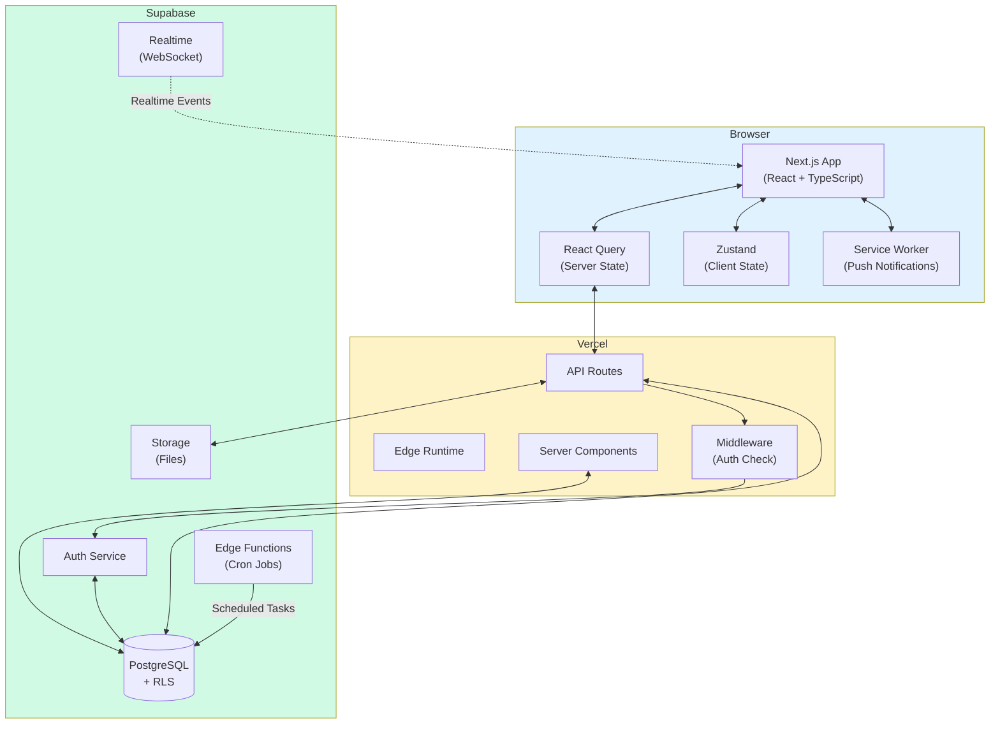

---

## 2. 데이터 흐름도

### 2.1 인증 흐름

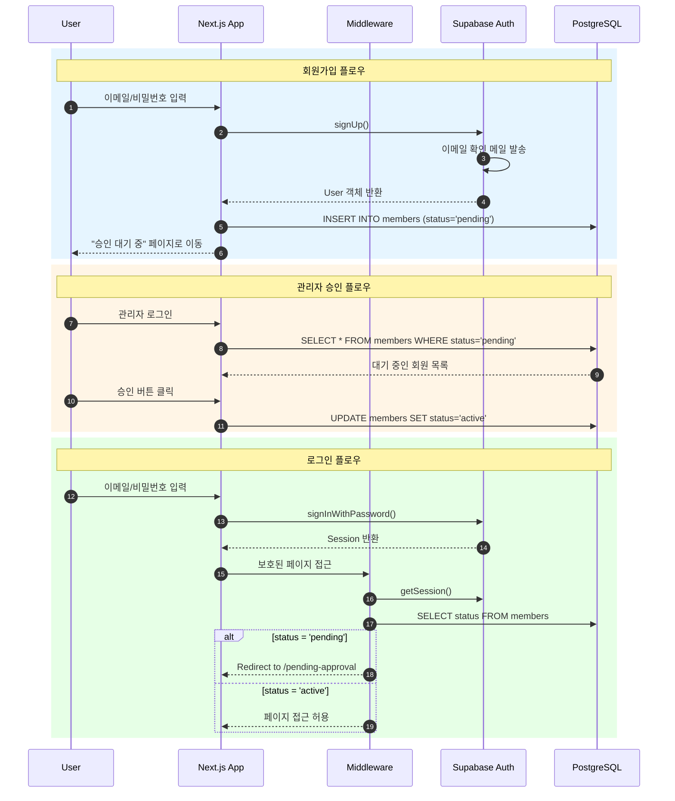

### 2.2 데이터 조회 흐름

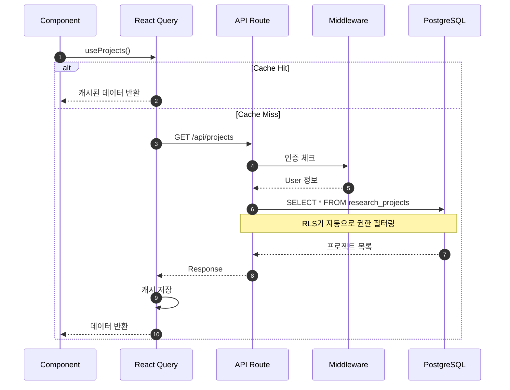

### 2.3 진행률 자동 계산 흐름

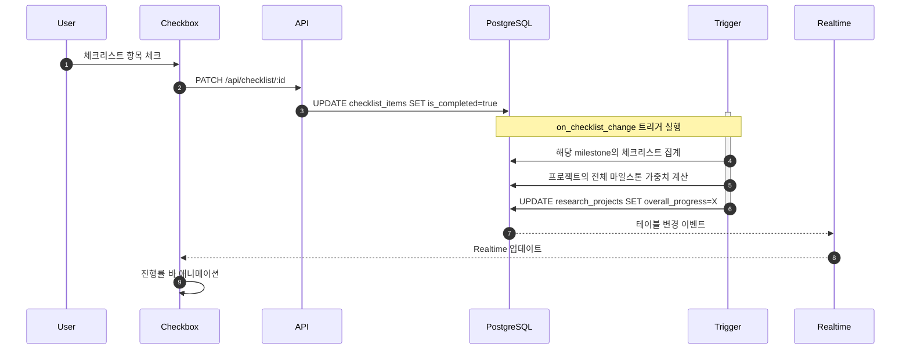

---

## 3. ER 다이어그램

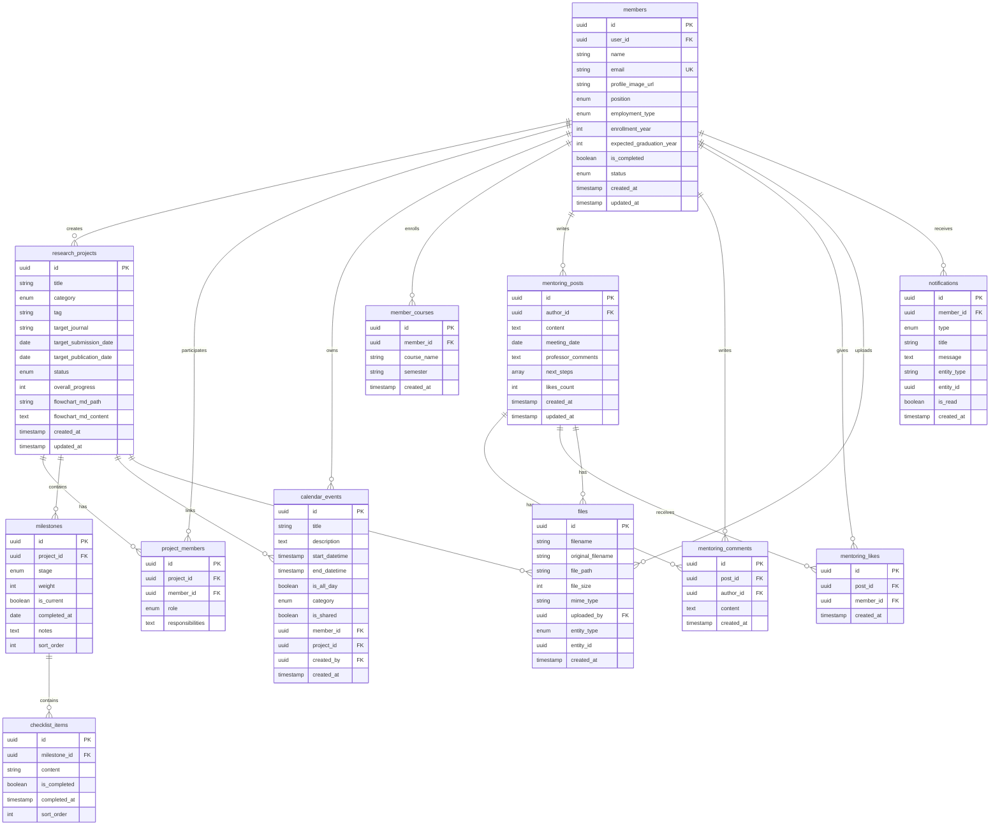

---

## 4. 사용자 인터페이스 구조

### 4.1 페이지 구조

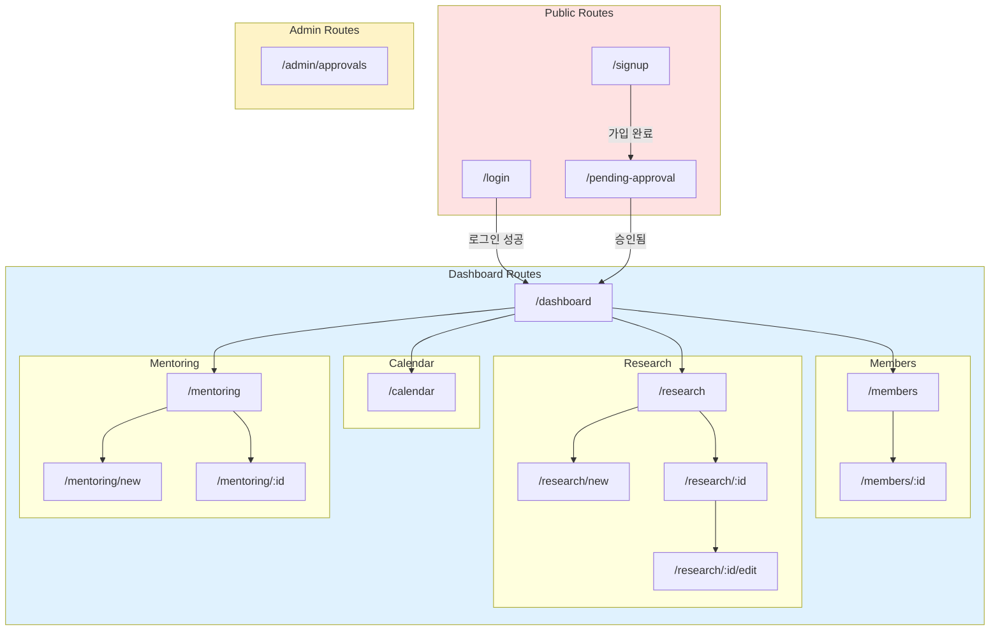

### 4.2 레이아웃 구조

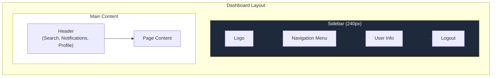

---

## 5. 컴포넌트 계층 구조

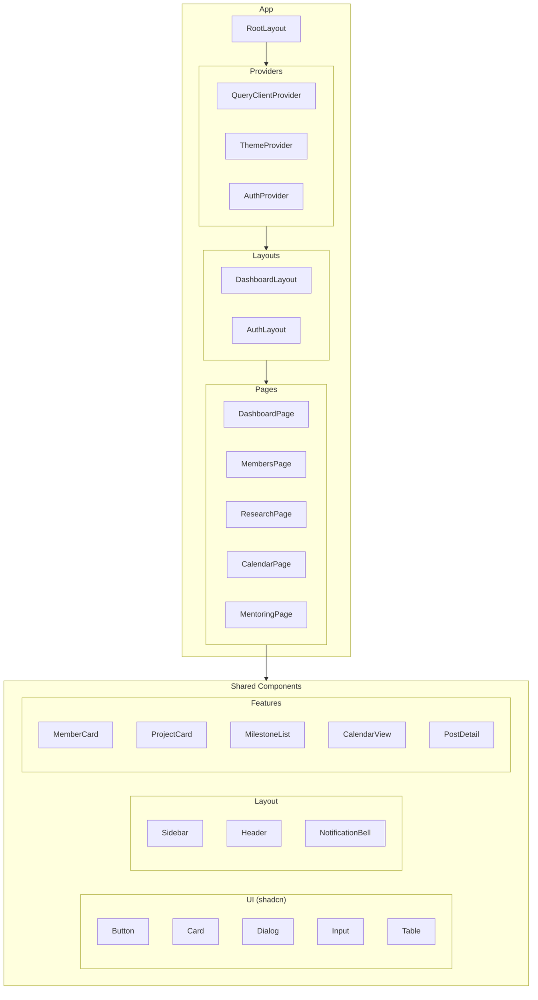

---

## 6. 알림 시스템 아키텍처

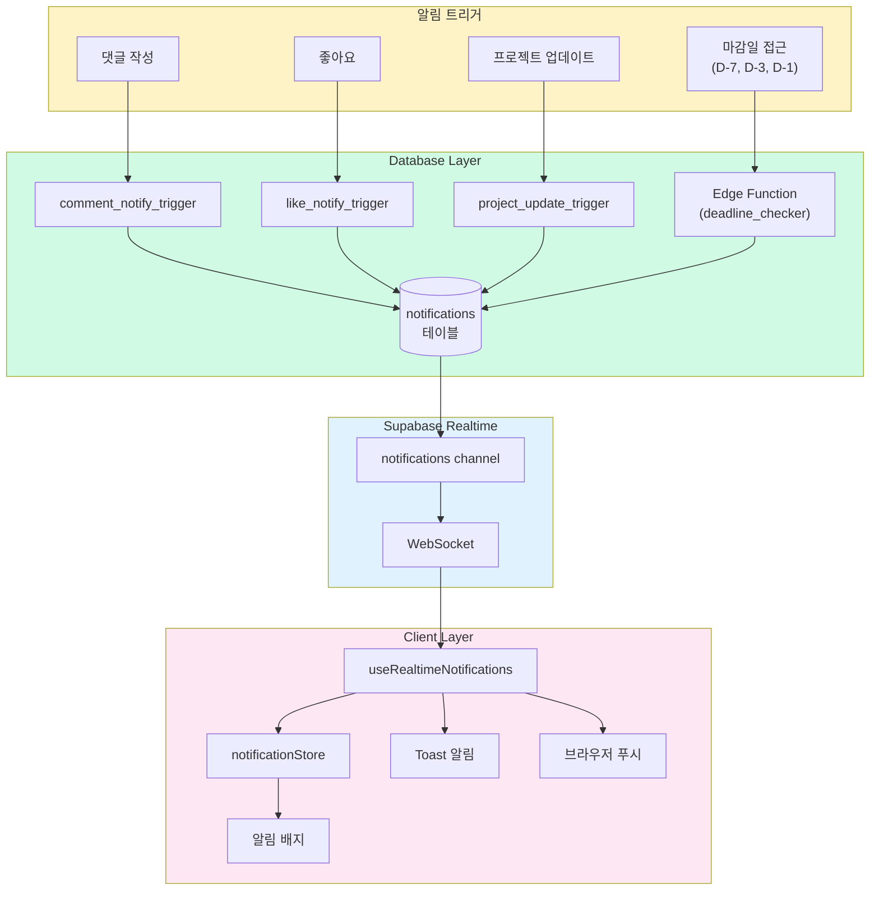

---

## 7. 파일 업로드 흐름

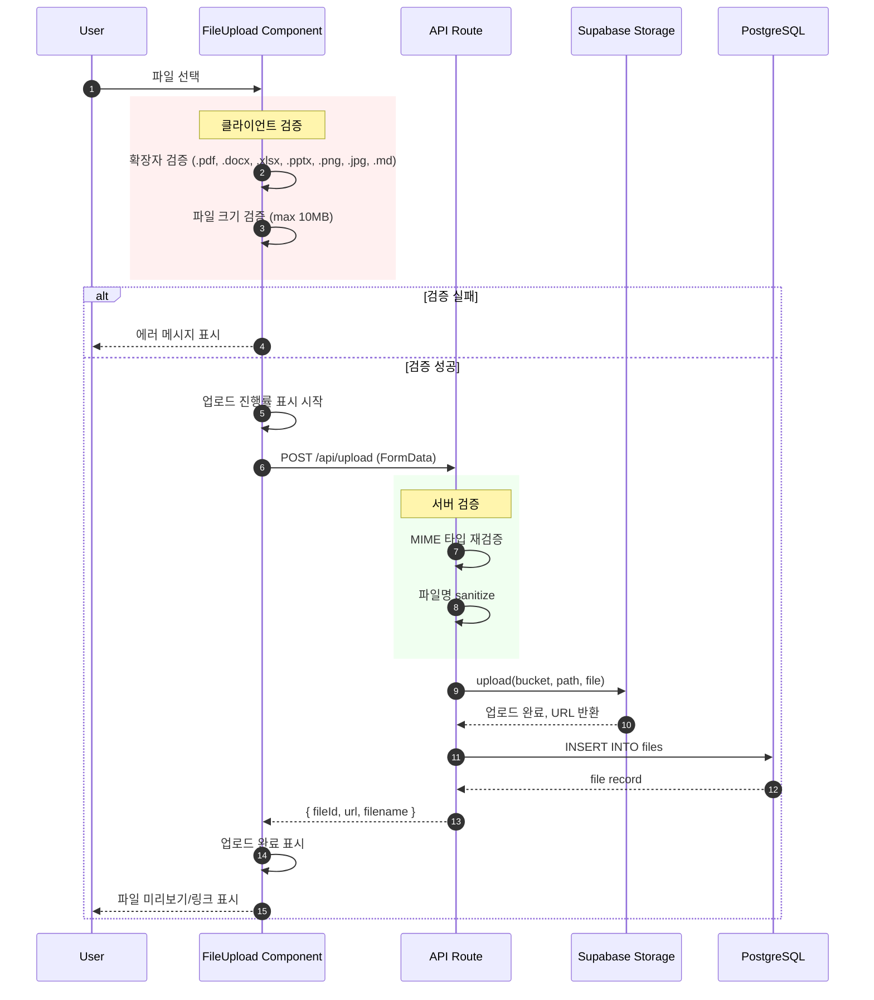

---

## 8. 상태 관리 흐름

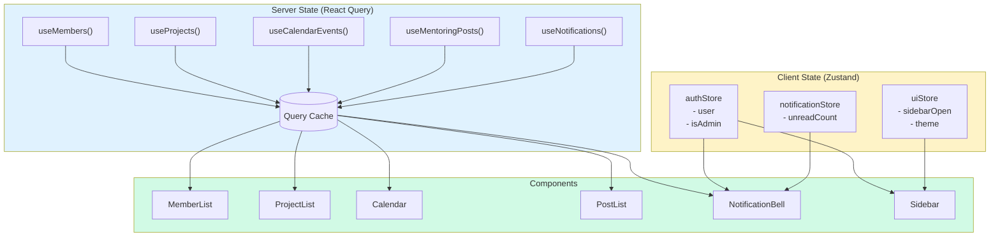

---

## 9. 배포 아키텍처

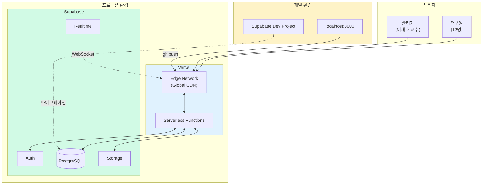

---

## 10. 보안 레이어

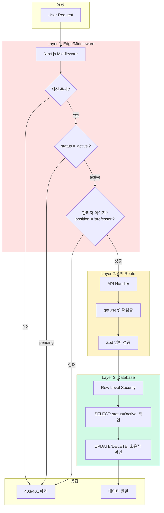
