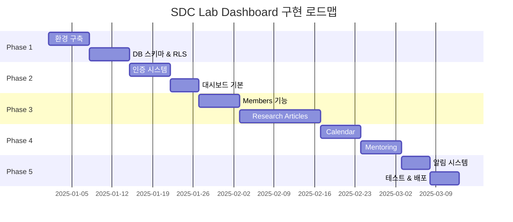
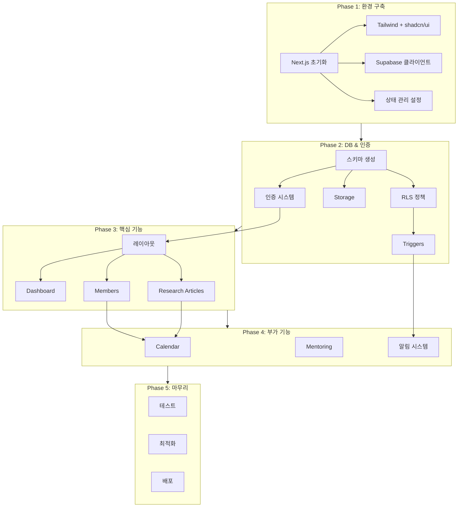

# SDC Lab Dashboard - 구현 계획서

## 1. 구현 단계 개요



---

## 2. Phase 1: 환경 구축

### 2.1 체크리스트

- [ ] **프로젝트 초기화**
  - [ ] Next.js 14 프로젝트 생성 (App Router)
  - [ ] TypeScript strict mode 설정
  - [ ] ESLint + Prettier 설정
  - [ ] 디렉토리 구조 생성

- [ ] **UI 프레임워크 설정**
  - [ ] Tailwind CSS 설치 및 설정
  - [ ] shadcn/ui 초기화
  - [ ] 테마 색상 설정 (tailwind.config.ts)
  - [ ] 폰트 설정 (Pretendard + Inter)
  - [ ] 기본 UI 컴포넌트 추가 (button, card, dialog, input, etc.)

- [ ] **상태 관리 설정**
  - [ ] React Query 설치 및 Provider 설정
  - [ ] Zustand 설치
  - [ ] 기본 스토어 생성 (uiStore, authStore)

- [ ] **Supabase 연동**
  - [ ] Supabase 프로젝트 생성
  - [ ] 환경 변수 설정 (.env.local)
  - [ ] Supabase 클라이언트 설정 (client, server, middleware)
  - [ ] TypeScript 타입 생성 명령어 설정

### 2.2 의존성

```bash
# 핵심 패키지
npm install @supabase/supabase-js @supabase/ssr
npm install @tanstack/react-query zustand
npm install react-markdown remark-gfm

# UI 관련
npx shadcn-ui@latest init
npm install lucide-react
npm install date-fns
npm install zod react-hook-form @hookform/resolvers

# 캘린더
npm install @fullcalendar/react @fullcalendar/daygrid @fullcalendar/interaction
```

### 2.3 위험 요소

| 위험 | 영향 | 대응 |
|------|------|------|
| shadcn/ui 버전 호환성 | 중 | 공식 문서 버전 확인, Next.js 14 호환 버전 사용 |
| Supabase 무료 티어 제한 | 저 | 사용량 모니터링, 필요시 최적화 |

---

## 3. Phase 2: 데이터베이스 & 인증

### 3.1 체크리스트

- [ ] **스키마 생성**
  - [ ] members 테이블
  - [ ] research_projects 테이블
  - [ ] project_members 테이블
  - [ ] milestones 테이블
  - [ ] checklist_items 테이블
  - [ ] calendar_events 테이블
  - [ ] member_courses 테이블
  - [ ] mentoring_posts 테이블
  - [ ] mentoring_comments 테이블
  - [ ] mentoring_likes 테이블
  - [ ] files 테이블
  - [ ] notifications 테이블

- [ ] **RLS 정책 설정**
  - [ ] members: 조회(all), 수정(self), 상태변경(admin)
  - [ ] research_projects: 조회(all), CRUD(all), 삭제(admin)
  - [ ] mentoring_posts: 조회(all), 생성(all), 수정(self), 삭제(self+admin)
  - [ ] notifications: 조회(self), 생성(system)
  - [ ] 기타 테이블 RLS 적용

- [ ] **Database Triggers**
  - [ ] 진행률 자동 계산 트리거 (checklist_items 변경 시)
  - [ ] 좋아요 카운트 업데이트 트리거
  - [ ] 알림 생성 트리거 (댓글, 좋아요)
  - [ ] updated_at 자동 갱신 트리거

- [ ] **Edge Functions (선택)**
  - [ ] 마감일 알림 스케줄러 (D-7, D-3, D-1)

- [ ] **Storage 설정**
  - [ ] 버킷 생성 (profiles, projects, mentoring)
  - [ ] 버킷 정책 설정 (업로드/다운로드 권한)

- [ ] **인증 시스템**
  - [ ] Supabase Auth 이메일 인증 설정
  - [ ] 회원가입 페이지 (/signup)
  - [ ] 로그인 페이지 (/login)
  - [ ] 승인 대기 페이지 (/pending-approval)
  - [ ] 미들웨어 인증 체크
  - [ ] 로그아웃 기능
  - [ ] 관리자 승인 페이지 (/admin/approvals)

### 3.2 의존성 순서

```
1. 테이블 생성 (외래키 순서 고려)
   └── members (기본)
       ├── research_projects
       │   ├── project_members
       │   └── milestones
       │       └── checklist_items
       ├── calendar_events
       ├── member_courses
       ├── mentoring_posts
       │   ├── mentoring_comments
       │   └── mentoring_likes
       ├── files
       └── notifications

2. RLS 정책 (테이블 생성 후)

3. Triggers (테이블 + RLS 후)

4. Storage (독립적)

5. Auth 설정 (members 테이블 필요)
```

### 3.3 위험 요소

| 위험 | 영향 | 대응 |
|------|------|------|
| RLS 정책 누락으로 데이터 노출 | 높 | 모든 테이블에 RLS 활성화 검증, 테스트 케이스 작성 |
| 트리거 무한 루프 | 중 | 트리거 조건 명확히, 테스트 환경에서 검증 |
| 이메일 인증 실패 | 중 | SMTP 설정 확인, 대체 인증 방법 준비 |

---

## 4. Phase 3: 핵심 기능 개발

### 4.1 대시보드 체크리스트

- [ ] **레이아웃**
  - [ ] 사이드바 컴포넌트 (240px, 반응형)
  - [ ] 헤더 컴포넌트 (알림 벨, 사용자 메뉴)
  - [ ] 메인 콘텐츠 영역

- [ ] **대시보드 페이지**
  - [ ] 요약 통계 카드 (전체 프로젝트, 활성 연구원, 이번 달 멘토링)
  - [ ] 이번 주 일정 미리보기
  - [ ] 진행 중 연구 현황 (상위 5개)
  - [ ] 최근 멘토링 기록 (최근 3개)

### 4.2 Members 체크리스트

- [ ] **목록 페이지**
  - [ ] 연구원 카드 그리드 (반응형)
  - [ ] Position 뱃지 (색상별)
  - [ ] 필터링 (position, employment_type, status)
  - [ ] 검색 기능

- [ ] **상세 페이지**
  - [ ] 프로필 정보 표시
  - [ ] 수강 교과목 목록
  - [ ] 참여 프로젝트 목록
  - [ ] 개인 캘린더 (해당 연구원 일정만)
  - [ ] 멘토링 기록

### 4.3 Research Articles 체크리스트

- [ ] **목록 페이지**
  - [ ] 프로젝트 카드 (진행률 바 포함)
  - [ ] 카테고리 필터 (thesis, submission, revision, etc.)
  - [ ] 상태 필터 (preparing, under_review, etc.)
  - [ ] 정렬 (최신순, 진행률순, 마감일순)

- [ ] **상세 페이지**
  - [ ] 프로젝트 기본 정보
  - [ ] 참여 연구원 목록 (역할별)
  - [ ] 마일스톤 리스트 (아코디언)
  - [ ] 체크리스트 (체크박스)
  - [ ] 진행률 바 (실시간 업데이트)
  - [ ] 연구 흐름도 (MD 렌더링)
  - [ ] 첨부파일 목록

- [ ] **생성/수정**
  - [ ] 프로젝트 폼
  - [ ] 연구원 추가/제거
  - [ ] 마일스톤 관리
  - [ ] 체크리스트 항목 추가/수정/삭제
  - [ ] 흐름도 MD 업로드
  - [ ] 파일 첨부

### 4.4 의존성 순서

```
1. 레이아웃 (사이드바, 헤더)
2. 대시보드 기본 구조
3. Members 목록 → 상세
4. Research 목록 → 상세 → 생성/수정
5. 대시보드 위젯 연동
```

### 4.5 위험 요소

| 위험 | 영향 | 대응 |
|------|------|------|
| MD 렌더링 XSS | 높 | DOMPurify 사용, 위험한 태그 필터링 |
| 대용량 파일 업로드 실패 | 중 | 진행률 표시, 재시도 로직, 청크 업로드 고려 |
| 복잡한 쿼리 성능 | 중 | 인덱스 추가, 필요한 필드만 select, 페이지네이션 |

---

## 5. Phase 4: 부가 기능 개발

### 5.1 Calendar 체크리스트

- [ ] **캘린더 뷰**
  - [ ] 월간 뷰 (FullCalendar)
  - [ ] 일정 색상 (카테고리별)
  - [ ] 카테고리 필터
  - [ ] 공용/개인 일정 구분

- [ ] **이벤트 CRUD**
  - [ ] 이벤트 생성 모달
  - [ ] 이벤트 수정
  - [ ] 이벤트 삭제
  - [ ] 드래그 & 드롭 (날짜 변경)

### 5.2 Mentoring 체크리스트

- [ ] **목록 페이지**
  - [ ] 게시물 카드 (작성자, 날짜, 좋아요 수)
  - [ ] 무한 스크롤 또는 페이지네이션
  - [ ] 작성자 필터

- [ ] **상세 페이지**
  - [ ] 게시물 내용
  - [ ] 교수 코멘트 섹션
  - [ ] 다음 단계 목록
  - [ ] 첨부파일
  - [ ] 좋아요 버튼
  - [ ] 댓글 목록
  - [ ] 댓글 작성

- [ ] **작성/수정**
  - [ ] 에디터 (마크다운 또는 리치 텍스트)
  - [ ] 미팅 날짜 선택
  - [ ] 교수 코멘트 입력
  - [ ] 다음 단계 입력 (배열)
  - [ ] 파일 첨부

### 5.3 알림 시스템 체크리스트

- [ ] **알림 UI**
  - [ ] 헤더 알림 벨 (배지)
  - [ ] 알림 드롭다운 목록
  - [ ] 알림 상세 페이지 (선택)
  - [ ] 읽음 표시

- [ ] **Realtime 연동**
  - [ ] Supabase Realtime 구독
  - [ ] 새 알림 시 UI 업데이트
  - [ ] 브라우저 Notification API 연동

- [ ] **알림 생성 로직**
  - [ ] 댓글 알림 트리거
  - [ ] 좋아요 알림 트리거
  - [ ] 프로젝트 업데이트 알림 트리거
  - [ ] 마감일 알림 Edge Function (D-7, D-3, D-1)

### 5.4 위험 요소

| 위험 | 영향 | 대응 |
|------|------|------|
| FullCalendar 번들 크기 | 중 | dynamic import, tree-shaking |
| Realtime 연결 끊김 | 중 | 재연결 로직, 연결 상태 표시 |
| 알림 과다 | 저 | 알림 설정 페이지, 묶음 알림 고려 |

---

## 6. Phase 5: 마무리

### 6.1 체크리스트

- [ ] **테스트**
  - [ ] 주요 기능 수동 테스트
  - [ ] 권한 테스트 (일반 사용자 vs 관리자)
  - [ ] 반응형 테스트 (모바일, 태블릿, 데스크톱)
  - [ ] 크로스 브라우저 테스트

- [ ] **성능 최적화**
  - [ ] Lighthouse 점수 확인
  - [ ] 불필요한 리렌더링 제거
  - [ ] 이미지 최적화

- [ ] **보안 점검**
  - [ ] RLS 정책 검증
  - [ ] 입력값 검증 (Zod)
  - [ ] XSS 방지 확인

- [ ] **배포**
  - [ ] Vercel 프로젝트 연결
  - [ ] 환경 변수 설정
  - [ ] 도메인 설정 (선택)
  - [ ] 배포 및 검증

- [ ] **문서화**
  - [ ] README 업데이트
  - [ ] 사용자 가이드 (선택)

---

## 7. 전체 의존성 그래프



---

## 8. 위험 요소 종합

### 8.1 높은 위험

| ID | 위험 | 영향 | 대응 전략 |
|----|------|------|-----------|
| R1 | RLS 정책 누락으로 데이터 노출 | 보안 침해 | 모든 테이블 RLS 체크리스트, 배포 전 검증 |
| R2 | MD 렌더링 XSS 취약점 | 보안 침해 | DOMPurify 적용, 허용 태그 화이트리스트 |
| R3 | 인증 우회 | 보안 침해 | 미들웨어 + 서버 사이드 이중 검증 |

### 8.2 중간 위험

| ID | 위험 | 영향 | 대응 전략 |
|----|------|------|-----------|
| R4 | Supabase 무료 티어 초과 | 서비스 중단 | 사용량 모니터링, 쿼리 최적화 |
| R5 | 복잡한 쿼리 성능 저하 | UX 저하 | 인덱스, 캐싱, 페이지네이션 |
| R6 | 파일 업로드 실패 | 기능 장애 | 재시도 로직, 에러 핸들링 |
| R7 | Realtime 연결 불안정 | UX 저하 | 재연결 로직, 폴백 메커니즘 |

### 8.3 낮은 위험

| ID | 위험 | 영향 | 대응 전략 |
|----|------|------|-----------|
| R8 | 브라우저 호환성 | 일부 기능 장애 | 폴리필, 점진적 기능 저하 |
| R9 | 번들 크기 증가 | 초기 로딩 지연 | 코드 스플리팅, lazy loading |

---

## 9. 마일스톤 체크포인트

| 마일스톤 | 완료 기준 | 검증 항목 |
|----------|-----------|-----------|
| M1: 환경 완료 | 빈 대시보드 페이지 렌더링 | Supabase 연결, UI 컴포넌트 동작 |
| M2: DB 완료 | 테이블 생성, RLS 적용 | SQL 실행 성공, 정책 테스트 |
| M3: 인증 완료 | 로그인/회원가입/승인 동작 | 전체 인증 플로우 테스트 |
| M4: 핵심 기능 | Dashboard, Members, Research 동작 | CRUD 테스트, 권한 테스트 |
| M5: 전체 기능 | Calendar, Mentoring, 알림 동작 | 전체 기능 E2E 테스트 |
| M6: 배포 | 프로덕션 환경 정상 동작 | Vercel 배포, 도메인 접속 |

---

## 10. 초기 데이터 시딩

배포 후 초기 데이터:

```sql
-- 관리자 계정 (수동 생성 필요)
-- 1. Supabase Auth에서 jaeho@uos.ac.kr 계정 생성
-- 2. members 테이블에 레코드 추가 (status='active', position='professor')

-- 기타 연구원은 자가 가입 후 관리자 승인
```
